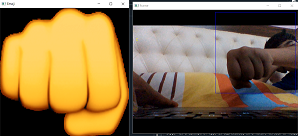

# Hand-Gesture-Emoji-Detector

A project I have been meaning to try out for a long time but never got the time to. It is a simple hand gesture detection model where instead of gesture labels we get the corresponding emoji. I used over 800 images per gesture which were taken from [Kaggle's Hand Gesture Recognition Database](https://www.kaggle.com/gti-upm/leapgestrecog) . There are definately more than that in the dataset but I chose to work with these many only to get a good enough model. I have used a triple layer convolutional neural network to get an accuracy of 84%.

One of the problems that I couldn't resoLve was to get the emoji appear on the video frame itself. Feel free to contribute if you can solve that or get a better architecture.

Update: The model accuracy when training using `trainv2.py` gives around ~99%. The predictor will need to be updated to accomodae the 10 classes used to train the model. Feel free to contribute!

## OUTPUT

### Palm

### Fist

### Index Up

### Okay

## Try it out on colab!
  
The colab file includes a data generator to download, extract and construct the data folders.
Using avg_pool and some kernel_regularizers, the accuracy has been bumped to ~99%.
Further, there are model metrics vizualizations for the training process.

